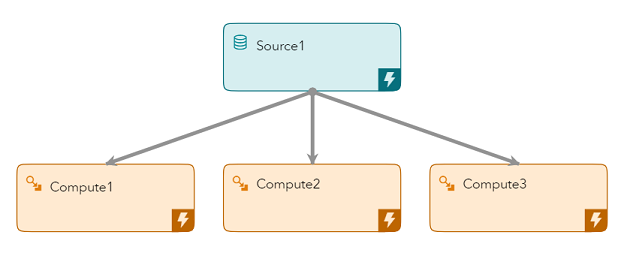
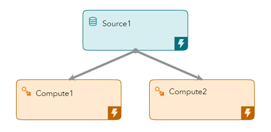
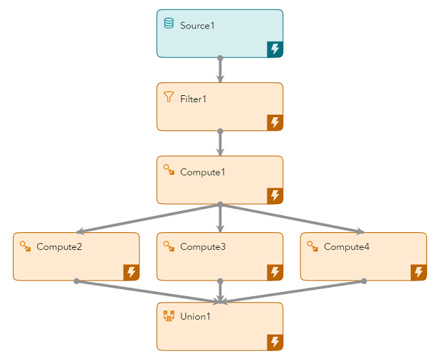
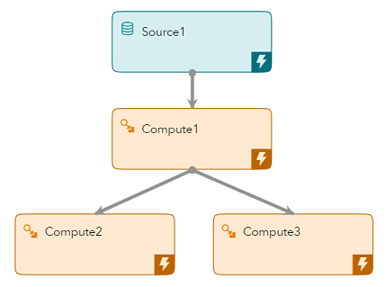

# Splitting Data Streams in ESP

This repository contains example ESP projects and data which will help you incorporate splitters into your ESP streaming models

## Introduction

When building an ESP project to consume streams of data, we frequently encounter situations in which it makes sense to have certain events take one path and for other events to take other paths. Sometimes, we want to have different branches in an ESP project that will have their own logic, and we need to route events based on that. Another case would be when we are not achieving the performance we need, so we will want to parallelize the processing in order to increase throughput.
In all these cases, we need to create a splitter to help us route the events. Let’s see how to split a stream of data in ESP. We’ll first go over a few simple cases, and then something a bit more intricate.

We will look at two basic splitters and three more complex splitters.

## Creating a basic splitter

### Basic Splitter 1



In any case, the first step is to always create a window with a splitter expression as shown here:

```diff
<window-source pubsub="true" index="pi_EMPTY" name="Source1">
  <splitter-expr>
    <expression>sequence%3</expression>
  </splitter-expr>
  <schema>
    <fields>
      <field name="sequence" type="int64" key="true"/>
      <field name="message" type="string"/>
    </fields>
  </schema>
</window-source>
```

We are using a source window here, but a splitter expression can be applied to any window type in the same way it is used in the above example.

The code above after `<expression>` shows how we can input an expression to generate the different values on which we want to split. In this case, we want to split this stream 3 ways and so we are taking the remainder when dividing the sequence by 3.

Once this is done, we finish the process by specifying which outgoing edge will get which events. We go to the ```<edges>``` section of the xml, or in ESP studio just click on an edge. Here is an example of that:

```diff
<edges>
  <edge source="Source1" target="Compute1" slot="0"/>
  <edge source="Source1" target="Compute2" slot="1"/>
  <edge source="Source1" target="Compute3" slot="2"/>
</edges>
```

The slot here is the value of the sequence number modulo 3, and we can have as many slots as we need.

### Basic Splitter 2



Another type of splitter that is easy to create is one that sends an event down a particular path based on the first letter in a string in the event. For example, let’s say that our event stream contains names, and we want events with names that begin with A-M to go one way, and events with names that begin with N-Z to go the other way.

To achieve this, we can make use of the fact that letters can be compared to each other numerically when they are part of the ASCII character set. Here is an example of a splitter expression in a source window that demonstrates this:

```diff
<window-source pubsub="true" name="Source1">
  <splitter-expr>
    <expression><![CDATA[if left(name,1)<'N' then return 0 else return 1]]></expression>
  </splitter-expr>
  <schema>
    <fields>
      <field name="sequence" type="int64" key="true"/>
      <field name="name" type="string"/>
    </fields>
  </schema>
</window-source>
```

In the highlighted code, we are using the function ```left()``` which accepts two arguments: the string to be parsed and the number of characters to be returned from the left end of the string. In our case, we are taking the leftmost character of the string ```name``` and comparing it to the letter ‘N’. If the ASCII value of the first letter in the name is less than the ASCII value of ‘N’ then the splitter expression returns 0, and the splitter expression returns 1 if the ASCII value of the first letter in the name is greater or equal to the ASCII value of ‘N’. The numbers corresponding to letters in the table of ASCII values are not intuitive, so it’s best to consult that table when splitting on strings that might contain lower case as well as upper case and other characters.

## Creating a more complex splitter

### Complex Splitter 1



Here is an example of a compute window in which we give a sequence number to the events that come through this window, and we use the value of the split variable modulo 3 as our splitter. Perhaps our original data stream contained events that we filtered out and we want to split the stream after the filter at regular intervals. We might do this if we are performing operations and/or calculations on the data that are computationally expensive, like string parsing, and can be done in parallel. 

```diff
<window-compute pubsub="true" name="Compute1">
  <splitter-expr>
    <expression><![CDATA[splitter%3]]></expression>
  </splitter-expr>
  <expr-initialize>
    <initializer type="int32"><![CDATA[integer split split=0]]></initializer>
    <udfs>
      <udf name="myFunction" type="int32"><![CDATA[split=split+1; return split;]]></udf>
    </udfs>
  </expr-initialize>
  <schema>
    <fields>
      <field name="sequence" type="int64" key="true"/>
      <field name="tag" type="string"/>
      <field name="value" type="double"/>
      <field name="splitter" type="int32"/>
    </fields>
  </schema>
  <output>
    <field-expr><![CDATA[tag]]></field-expr>
    <field-expr><![CDATA[value]]></field-expr>
    <field-expr><![CDATA[myFunction()]]></field-expr>
  </output>
</window-compute>
```

As we saw above, the ```<expression>``` line is needed so that the event gets the value assigned to it for splitting. The code after ```<initializer type="int32">``` shows how to create this variable and initialize it at zero, and then it can be incremented from there. We are creating an int32 here, but it can be any of the other data types available in ESP. The code after ```<udf name="myFunction" type="int32">``` is the function we define that will return the value of the variable we just created. We call the function by creating a non-key field matching the name of the variable used in ```<expression>```, and for the corresponding field-expr we just call the function. Our function has no inputs, but data from the other fields in the event is available implicitly.

Notice that we create an internal variable called split, but the splitter expression uses the field name which holds the result of the call to ```myFunction()```.

### Complex Splitter 2



Let’s say that you want to split your data stream using a string field. You are splitting by city name, but you are only interested in two cities in particular. You would do everything as above, and the only part that would differ is the code in ```<udfs>```. Here is an example of how that might look:

```diff
<udf name="myFunction1" type="string"><![CDATA[
  if city=="NYC" then
    begin
      split=1;
      return split
    end
  else if city=="Raleigh" then
    begin
      split=2;
      return split
    end
  else
    begin
      split=0;
    end
  return split]]></udf>
```

In this case, we are assigning an integer based on the cities we are interested in. This is a very basic application of a function, but it’s easy to see how this can be used in more complicated scenarios. If no edge is created with slot=”0” in this case, then those events will be dropped. Also, not all edges coming from a window must have slot numbers. If there is an edge with no slot number, while others do, all events will flow through that edge, in addition to going through their respective slots. Notice that there are multiple return statements. This is so that if one of the conditions is satisfied, we can exit out of the function without checking if the other conditions will be satisfied.

### Complex Splitter 3

Let’s consider a case in which our data stream consists of bunches of events, where each bunch corresponds to a transaction, and we want to route the bunches to the different slots. Here is a sample of what this data looks like:

```diff
i,n,1,v,1.35
i,n,2,e,2.72
i,n,3,g,3.14
i,n,4,t,1.62
i,n,5,v,0.57
i,n,6,e,5.46
i,n,7,g,2.98
i,n,8,t,4.21
```

As we can see, the bunches of data consist of 4 events each, but using this method the bunches can have different numbers of events and it won’t matter. We want to increment the splitter integer only at the beginning of each bunch. In our case, when ```type=="v"``` that signifies the beginning of a transaction. Here is an example of how to increment the counter based on some condition:

```diff
<udf name="myFunction" type="string"><![CDATA[
        if type=="v" then
          begin
            split=split+1;
            return split
          end
      return split]]></udf>
```

### Conclusion

We have gone over a few examples of how to split data streams in ESP. We might be splitting the data stream for logical purposes, or we might have to get the most performance out of our project. Whatever the reason, the techniques shown here will be all we need for the majority of applications.

### Prerequisites

[SAS Event Stream Processing 6.2](https://www.sas.com/en_us/software/event-stream-processing.html)

### Running

#### Running from a Command Line

Refer to the [Running the Splitter Examples from a Command Line](doc/command_line/readme.md) document for steps to run this project.

#### Running on the SAS Event Stream Processing Trial Environment

Refer to the [Running the Splitter Examples from the Trial Environment](doc/trial/readme.md) document for instrcutions on running this project in the SAS Event Stream Processing Trial Environment.

## Contributing

> We welcome your contributions! Please read [CONTRIBUTING.md](CONTRIBUTING.md) for details on how to submit contributions to this project. 

## License

> This project is licensed under the [Apache 2.0 License](LICENSE).

## Additional Resources

* [SAS Event Stream Processing 6.2 Documentation](https://go.documentation.sas.com/?cdcId=espcdc&cdcVersion=6.2&docsetId=espov&docsetTarget=home.htm&locale=en)